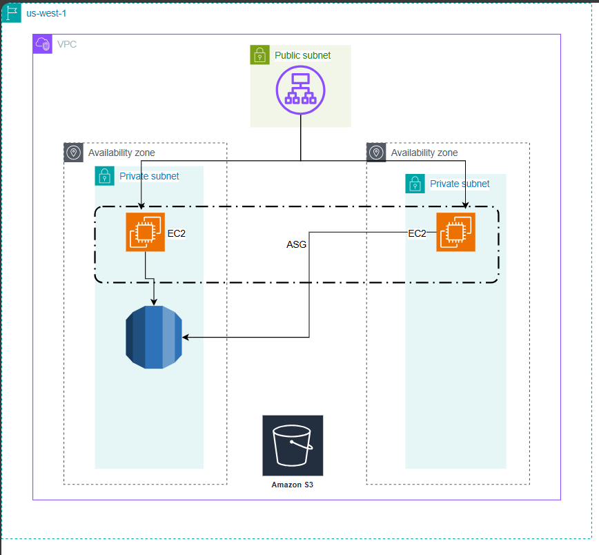

# AWS Scalable Web Application Architecture

This Terraform configuration sets up a scalable AWS web application architecture using modular Terraform configurations. It includes the necessary resources such as VPC, EC2 instances, ALB, RDS, and S3 buckets, with a focus on scalability, fault tolerance, and cost efficiency.

## A visual representation of the solution 


## Architecture Overview

The architecture includes:
- **VPC**: Virtual Private Cloud with public and private subnets.
- **EC2 Instances**: Auto-scaled instances running within private subnets.
- **ALB**: Application Load Balancer for distributing traffic.
- **RDS**: Managed database instance.
- **S3**: Object storage for static content.
- **NAT Gateway**: Allows private instances to access the internet.


# AWS Web Application Architecture - Security Best Practices

This document outlines the security best practices implemented in the AWS web application architecture. These practices ensure that the architecture is secure, scalable, and resilient, protecting sensitive data and resources from unauthorized access and potential threats.

## 1. Network Segmentation

- **Private Subnets:**  
  The RDS instance and S3 buckets are deployed in private subnets. This configuration prevents direct access from the internet, ensuring that only resources within the VPC can communicate with these services, thus reducing exposure to potential threats.

- **Public Subnet for ALB:**  
  The Application Load Balancer (ALB) is placed in a public subnet to handle incoming internet traffic. Security groups are configured to tightly control the traffic flow, allowing only necessary inbound traffic on the required ports (e.g., HTTP/HTTPS) and restricting access to other resources.

## 2. Security Groups

- **ALB Security Group:**  
  A security group is attached to the ALB to allow inbound traffic only on specific ports, ensuring that only authenticated and authorized traffic can reach the application.

- **EC2 Instance Security Group:**  
  The EC2 instances are configured with a security group that allows traffic only from the ALB, preventing unauthorized access from other sources.

- **Database Security Group:**  
  The RDS instance is secured with a security group that permits inbound traffic only from the EC2 instances within the private subnet, ensuring that only the application can interact with the database.

## 3. IAM Roles and Policies

- **S3 Bucket IAM Role:**  
  An IAM role is assigned to the EC2 instances, granting secure access to the S3 bucket for storing and retrieving static content. This role adheres to the principle of least privilege, ensuring that instances have only the necessary permissions.

- **SSM Managed Policy:**  
  The EC2 instances are granted the `AmazonSSMManagedInstanceCore` policy, allowing secure and auditable management via AWS Systems Manager (SSM) without the need for direct SSH access.

## 4. Password Management

- **Managed Master User Password:**  
  The RDS instance is configured with `manage_master_user_password = true`, allowing AWS to securely manage the database master user password. This setup includes automatic password rotation, enhancing security by reducing the risk of password exposure or compromise.

## 5. Modular Configuration

- **Reusability:**  
  All configurations, including VPC, subnets, security groups, IAM roles, and other resources, are organized into modules. This modular approach enhances reusability, maintainability, and consistency across different environments and applications.

## 6. Additional Security Considerations

- **Encryption:**  
  - Enable server-side encryption for S3 buckets.
  - Use encrypted storage for RDS.


---

By following these security best practices, the AWS web application architecture is designed to protect sensitive data and resources effectively while maintaining high availability and scalability.


## File Structure

    ├── infrastructure
    │ ├── main.tf
    │ ├── variables.tf
    │ ├── outputs.tf
    │ ├── terraform.tfvars
    │ └── provider.tf
    ├── modules
    │ ├── vpc
    │ │ ├── main.tf
    │ │ ├── variables.tf
    │ │ ├── outputs.tf
    │ ├── security_groups
    │ │ ├── main.tf
    │ │ ├── variables.tf
    │ │ ├── outputs.tf
    │ ├── ec2
    │ │ ├── main.tf
    │ │ ├── variables.tf
    │ │ ├── outputs.tf
    │ ├── alb
    │ │ ├── main.tf
    │ │ ├── variables.tf
    │ │ ├── outputs.tf
    │ ├── rds
    │ │ ├── main.tf
    │ │ ├── variables.tf
    │ │ ├── outputs.tf
    │ ├── s3
    │ │   ├── main.tf
    │ │   ├── variables.tf
    │ │   ├── outputs.tf
    │ └── iam
    │     ├── main.tf
    │     ├── variables.tf
    │     └── outputs.tf


## Getting Started

### Prerequisites

- [Terraform](https://www.terraform.io/downloads) installed
- AWS credentials configured (e.g., using `aws configure`)

1. Tools need to Run Application Deployment
   1. AWS CLI
   2. Terraform Binary
2. Configure AWS Secret Key and access key to use for account we will be deploying to
```
aws configure
AWS Access Key ID [****************7BR5]: 
AWS Secret Access Key [****************J7zj]: 
Default region name [None]:
``` 
3. **Validate AWS Credentials:** Ensure AWS is configured with right credentials that have access to deploy terraform resources.

```
aws sts get-caller-identity

# output
{
    "UserId": "XXXXXXXXXXXXXX",
    "Account": "916XXXXXXXXXXX",
    "Arn": "arn:aws:iam::916XXXXXXXXXXX:user/***"
}
```


### Configuration

1. **Clone the repository**:
    ```bash
    git clone https://github.com/Hybeekay1/AWS-3-tier-Web-Application.git
    cd infrastructures
    ```

2. **Update `terraform.tfvars`** with your specific values:
    ```hcl
    aws_region       = "us-west-2"
    vpc_name         = "my-vpc"
    vpc_cidr         = "10.0.0.0/16"
    public_subnets   = ["10.0.1.0/24", "10.0.2.0/24"]
    private_subnets  = ["10.0.3.0/24", "10.0.4.0/24"]
    availability_zones = ["us-west-2a", "us-west-2b"]
    db_identifier    = "mydbinstance"
    db_username      = "admin"
    s3_bucket_name   = "my-s3-bucket-name"
    ```

3. **Initialize Terraform**:
    ```bash
    terraform init
    ```

4. **Plan the deployment**:
    ```bash
    terraform plan
    ```

5. **Apply the configuration**:
    ```bash
    terraform apply -auto-approve
    ```

 **Confirm the changes** when prompted.

6. **Clean up**
     ```bash
    terraform destroy -auto-approve
    ```


## Modules

### VPC Module

Configures the VPC, including subnets, NAT Gateway, and route tables.

### Security Groups Module

Defines security groups for ALB, EC2 instances, and RDS.

### EC2 Module

Sets up EC2 instances with auto-scaling using a launch template.

### ALB Module

Configures an Application Load Balancer and its listeners.

### RDS Module

Sets up an RDS instance with a DB subnet group.

### S3 Module

Creates an S3 bucket with versioning and encryption.

## Outputs

- `vpc_id`: The ID of the created VPC.
- `alb_dns_name`: The DNS name of the ALB.
- `rds_endpoint`: The endpoint of the RDS instance.
- `s3_bucket_name`: The name of the S3 bucket.

## Additional Notes

- **NAT Gateway**: Allows private subnet instances to access the internet while remaining inaccessible from the public internet.
- **Security**: Ensure sensitive data like database passwords are managed securely. Consider using AWS Secrets Manager or SSM Parameter Store for production environments.
